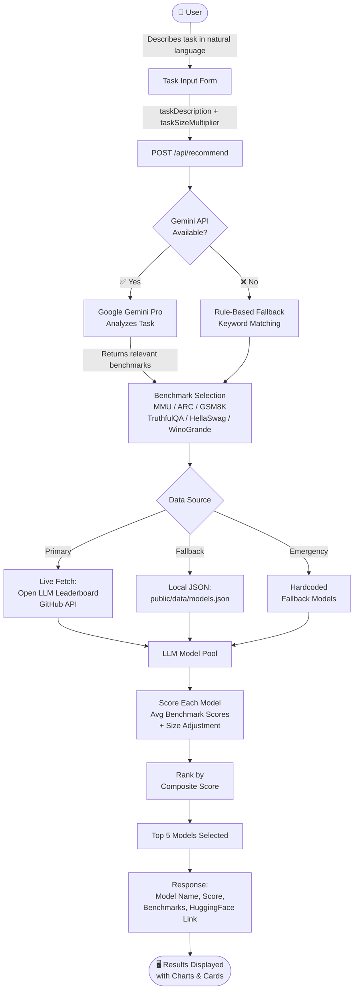

# ModelMatch AI

> Find the perfect open-source language model for your specific task using AI-powered analysis and Open LLM Leaderboard benchmarks.

🚀 **Live Demo**: [https://modelmatch-ai-1.onrender.com](https://modelmatch-ai-1.onrender.com)

---

## ✨ Features

- **AI-Powered Task Analysis**: Describe your task and ModelMatch AI uses Google Gemini to determine the most relevant evaluation benchmarks
- **Intelligent Model Matching**: Scores and ranks open-source LLMs based on their performance on task-relevant benchmarks
- **Size-Aware Recommendations**: Adjusts recommendations based on your task complexity and scale requirements
- **Open LLM Leaderboard Integration**: Uses real benchmark data from the Open LLM Leaderboard
- **Detailed Model Information**: View parameters, architecture, license, and benchmark scores for each recommended model
- **Direct HuggingFace Links**: One-click access to model repositories on HuggingFace
- **Example Tasks**: Pre-populated example tasks to help you get started quickly
- **Benchmark Visualizations**: Interactive radar and bar charts comparing models across different benchmarks
- **Searchable Leaderboard**: Browse, filter, and sort all available models
- **Developer Profile**: Direct links to the developer's GitHub and LinkedIn profiles

---

## 🔁 System Flowchart



---

## ⚙️ Setup

### Prerequisites

- Node.js 18+
- npm or pnpm
- A Google Gemini API key

### Installation

1. Clone the repository and install dependencies:
```bash
git clone https://github.com/PallikaMalhotra/ModelMatch-AI.git
cd ModelMatch-AI
npm install
```

2. Set up environment variables — create a `.env.local` file in the project root:
```env
GEMINI_API_KEY=your_api_key_here
```

> To get a Google API key:
> 1. Go to [Google AI Studio](https://aistudio.google.com/app/apikey)
> 2. Create a new API key for the **Gemini API**
> 3. Copy and paste it into your `.env.local` file

### Running Locally

```bash
npm run dev
```

Open [http://localhost:3000](http://localhost:3000) in your browser.

---

## 🔌 API Reference

### `POST /api/recommend`

Accepts a task description and returns the top 5 recommended LLMs.

**Request Body:**
```json
{
  "taskDescription": "I need a model for summarizing medical research papers",
  "taskSizeMultiplier": 1.5
}
```

**Response:**
```json
{
  "relevantBenchmarks": ["mmlu", "truthfulqa", "arc"],
  "reasoningDescription": "Task requires factual knowledge and accuracy",
  "recommendedModels": [
    {
      "name": "Llama-3.1-70B",
      "organization": "meta-llama",
      "score": 87.4,
      "reasoning": "Scored 87.4 based on mmlu, truthfulqa, arc benchmarks",
      "parameters": 70000000000,
      "license": "Llama 2 Community License",
      "benchmarks": { "mmlu": 85.2, "arc": 88.5, ... }
    }
  ]
}
```

---

## 🛠️ Tech Stack

| Layer | Technology |
|-------|-----------|
| **Framework** | Next.js 15 (App Router) |
| **Language** | TypeScript |
| **Styling** | Tailwind CSS v4 |
| **UI Components** | shadcn/ui (Radix UI) |
| **AI / LLM** | Google Gemini Pro (`@google/generative-ai`) |
| **LLM Framework** | LangChain + LangChain Google GenAI |
| **Vector DB** | ChromaDB |
| **Charts** | Recharts |
| **Forms** | React Hook Form + Zod |
| **Deployment** | Render |
| **Data Source** | Open LLM Leaderboard |

---

## 🚀 Deployment

This app is deployed on **[Render](https://render.com)**.

### Deploy your own:

1. Push your code to GitHub
2. Create a new **Web Service** on Render
3. Set the following:
   - **Build Command**: `npm install; npm run build`
   - **Start Command**: `npm start`
   - **Node Version**: `22`
4. Add environment variable:
   - `GEMINI_API_KEY` = your Gemini API key
5. Click **Deploy** ✅

---

## 👩‍💻 Developer

Built by **Pallika Malhotra**

- [GitHub](https://github.com/PallikaMalhotra)
- [LinkedIn](https://www.linkedin.com/in/pallika-malhotra-a9099729a/)

---

## 📄 License

MIT — free to use, modify, and distribute.
